**1.  How is a grayscale image represented on a computer? How about a color image?**

Image is comprised of pixels. Each pixel has a value from 0 to 255, where 0 represents white and 255 represents black. Grayscale image has only black and white and hence it will be a 2-dimensional matrix with values from 0 to 255. The size of the matrix depends on the number of pixels an image has, for example 28x28.

Color images are represented by a combination of red, green, and blue colors, i.e. the RGB values. These values also range from 0 to 255. Since there are three colors representing an image, on a computer this is given by a 3-dimensional matrix where the first and second dimensions are the width and height of an image and the 3rd dimension, or the depth of a matrix, is *red*, *green*, and *blue*. Visually we can represent it as follows:

<center>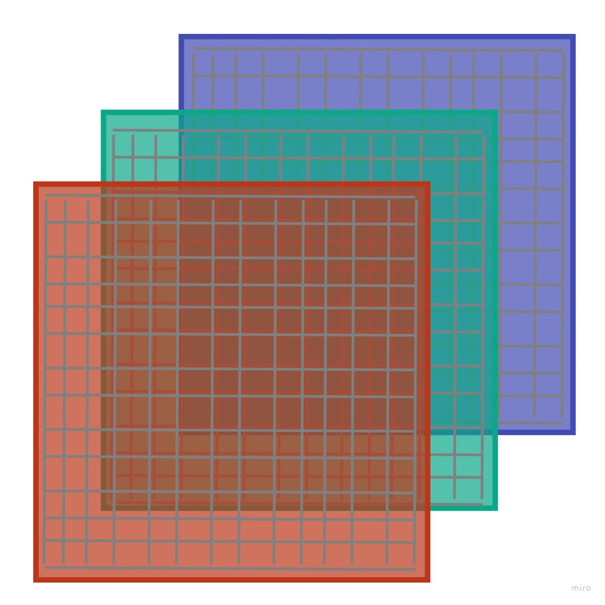</center>

where each little square is one pixel.

**2.  How are the files and folders in the MNIST_SAMPLE dataset structured? Why?**

The files and folders in the `MNIST_SAMPLE` dataset are structured in a classic way for computer vision problems, which is that there is a folder for training data called `train` and validation data called `valid`. Additionally, there is a file called `labels.csv` which has the information on the labels for each image. But we generally don't need this `*.csv` file since under `train` and `valid` there are further folders for each digit. So there is a single folder containing all digits of 1, 2, etc. Hence, the folder names denote the label of each image file contained in that specific folder.
  
The hierarchical structure visually would be as follows:

<center>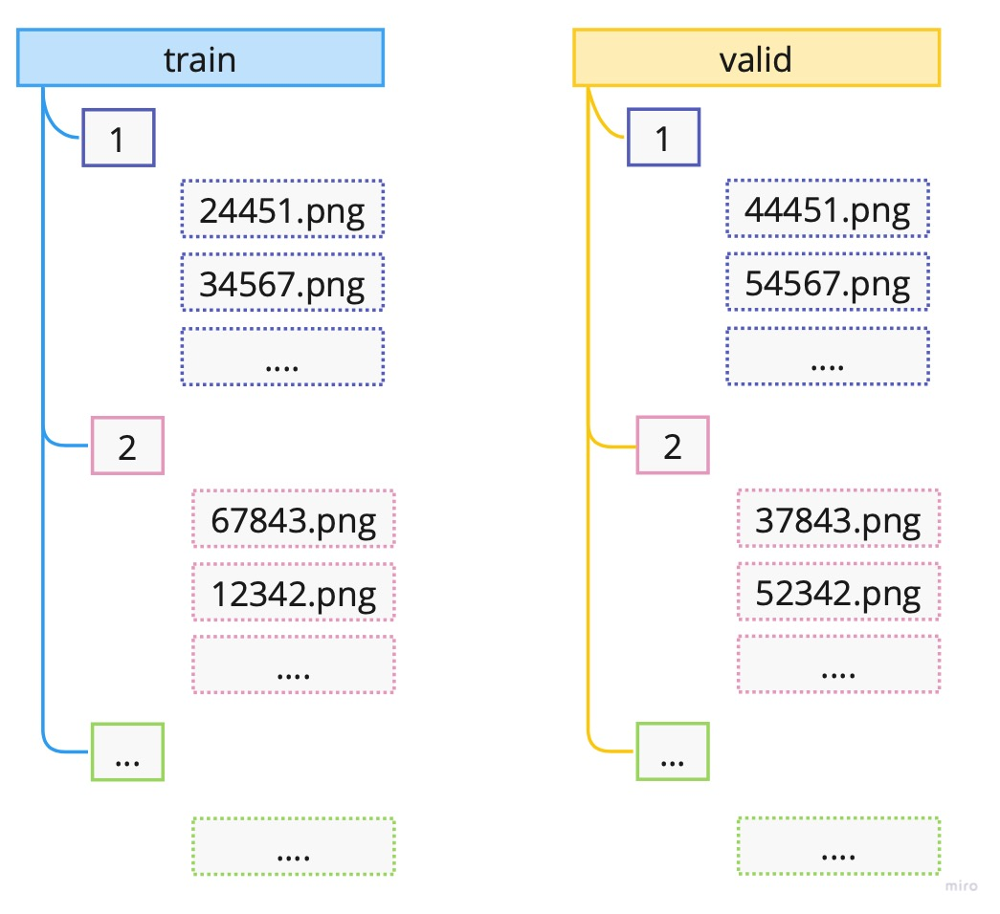</center>
  
**3. Explain how the “pixel similarity” approach to classifying digits works.**

Pixel similarity represents a simple benchmark model for the problem of classification of digits 3 and 7. 

**Benchmark model** is a simple, understandable and fast to implement model for the underlying problem. It provides us with an important stepping stone in our project or task at hand. #benchmark-model

The idea behind the pixel similarity is to take all the images of a specific digit, say digit 3, in the training sample and compute the average of each pixel. This way we would get what each pixel of a digit 3 should be, on average given the training sample. Note that if we change the underlying sample these average will naturally change. 

Visually we can represent the process as follows:

<center></center>

**Note**: This is a simplified version where one image has size of `4x4` meaning only 16 pixels.

As noted above, to get the average of a pixel, we would take those specific pixel values of all our images and computed the average. For example, for pixel 1, this would be the average of all the blue shaded values; for pixel 2 it would be orange shaded values, and so on.

Now we can take a new image and compute how far off (the distance) each pixel in our new image is from the "ideal" pixel value (the average) of the specified class from our training set. 

<center>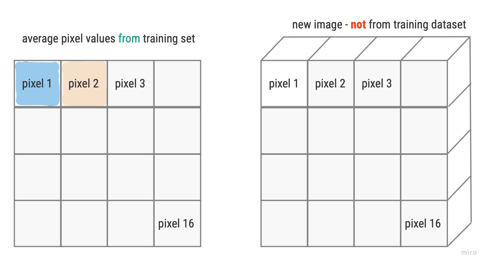</center>

To obtain one final value, instead of N pixel distances, we can compute the mean of the distances. For the distance measure we can choose L1-norm (mean absolute value) or the L2-norm (mean squared error).

For more details about computing the mean in PyTorch see notes: [prn.4100.1 - computing .mean(...) in PyTorch](), [prn.4100.1a - computing .mean(-1,-2) in PyTorch]()

**4.  What is a list comprehension? Create one now that selects odd numbers from a list and doubles them.** 

List comprehension is part of *idiomatic Python* (natural to Python) which enables the user to create a sort of a *for loop* without creating an actual for loop. It is much faster than a classic for loop. The structure is as follow:
```python
my_list = [f(o) for o in a_list if o>0]
```
If there is an `else` condition than the structure is as follows:
```python
my_list = [f(o) if o>0 else 1 for o in a_list]
```
In essence it creates a list called `my_list` so that for every value `o` in `a_list` it assigns `f(o)` if `o` is greater than 0 and 1 otherwise.  
  
*Note*: We can use list comprehension in pandas to create new column.

**5.  What is a rank-3 tensor?**

Rank-3 tensor is a 3-dimensional array i.e. and array with 3 direction points. Visually we can illustrate it as follows:

<center>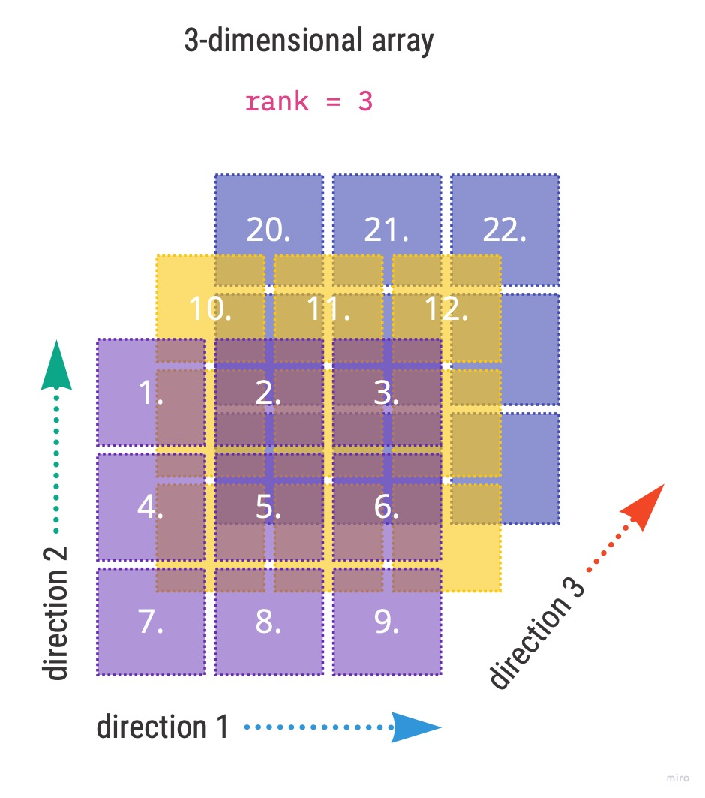</center>

Going back to the book example and image classification we had 1010 images each of size 28 by 28, which was represented by an tensor of rank 3. The direction 1 was 28, direction 2 was also 28 and the direction 3 was 1010.

More detailed account on [4100.2B - how to describe tensor rank]()

**6.  What is the difference between tensor rank and shape? How do you get the rank from the shape?**

Tensor rank gives us the dimension of a tensor i.e. the number of axes. Tensor shape, on the other hand provides the information on the size of each axis. 

Taking the example from the book where we had a tensor of 6131 images of a digit 3 the rank and shape was given by

```python
# Rank of my_tensor
len(my_tensor.shape)
>>> 3

# Shape of my_tensor
my_tensor.shape
>>> torch.Size([6131, 28, 28])
```

**7.  What are RMSE and L1 norm?**

RMSE and L1-norm are common *distance* measures of model results. RMSE stands for root mean squared error. The mathematical formulas for the measures are given by:
$$
RMSE = \sqrt{\frac{1}{n}\sum_{i=1}^{n}(\hat{y}_i - y_i)^2}
$$

$$
L1-norm = \frac{\sum_i|\hat{y}_i - y_i)|}{n}
$$
where $\hat{y}_i$ are our model predictions and $y_i$ are target labels for each $i$ in the given sample. As we can see in both function we are taking the difference of two values, the predictions and the target label. We can't just leave it at that since our predictions can over- or underestimate the target label hence resulting in positive and negative differences respectively. Hence, we need to ensure to not net the errors. We do this by squaring (RMSE) or taking absolute value (L1-norm) of the differences. In both cases we average the sum of all difference.

Some additional properties:

- taking the square root (RMSE) negates the squaring of the errors
- RMSE penalizes large errors significantly and is bigger than L1-norm
- RMSE can be used as a loss function, while L1-norm can not since it is not differentiable at $\hat{y_i} = y_i$

**8. How can you apply a calculation on thousands of numbers at once, many thousands of times faster than a Python loop?**

Use arrays or tensors, possibly on GPU.

**9. Create a 3×3 tensor or array containing the numbers from 1 to 9. Double it. Select the bottom-right four numbers.**

We can create a tensor or array using lists as follows:
```python
# Define the data: 3x3
data = [[1,2,3], [4,5,6], [7,8,9,]]

# Create an array from data
ad = array(data)

# Create a tensor from data
td = tensor(data)

print(td)
>>> tensor([[1, 2, 3], 
			[4, 5, 6], 
			[7, 8, 9]])
```

Let's check the shape of the tensor to ensure it is indeed `3x3`:
```python
td.shape
>>> torch.Size([3, 3])
```

To double the tensor we simply multiply by 2:
```python
# Double the tensor
tdd = td*2
print(tdd)
>>> tensor([[ 2, 4, 6], 
			[ 8, 10, 12], 
			[14, 16, 18]])
```
 
 and finally selecting the bottom-right 4 values:
```python
tdd[1:,1:]
>>> tensor([[10, 12], 
			[16, 18]])
```

**10. What is broadcasting?**

When we learned matrix operations we had to be extremely careful that certain dimensions match else we were not able to do numeric operations such as addition, multiplication, etc. In deep learning, often the dimensions do not match since we sometimes need to compare a stack of samples to a single unit of values. 

For example, we would like to compare an N number of images to a single image, where the comparison is by pixel. For this we can have a tensor of rank 3 such as `[1000, 28, 28]` where axis 1 denotes number of samples (images). If we would like to compare these pixel images to a single baseline image with rank `[28,28`] we need to use broadcasting method available in PyTorch.

What broadcasting does, it extends, **virtually**, the rank-2 tensor of baseline image so that the new *virtual* baseline image is a rank-3 tensor. So if we were to subtract these two tensors we would get a rank-3 tensor back as a result.

Visual representation:

<center>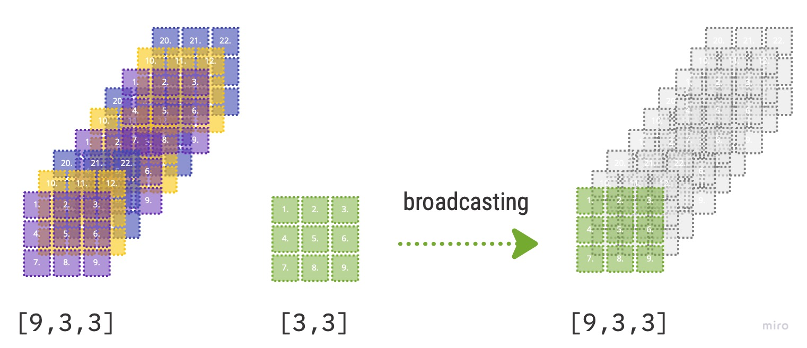</center>

- PyTorch *does not* make 9 copies of the initial rank-2 tensor; it virtually does this without any allocation of additional memory making it very efficient.
- "the computation is done in C", "..or in CUDA if you're using GPU" (Source: [[Deep Learning for Coders with fastai and PyTorch]] page 147)

**11. Are metrics generally calculated using the training set or the validation set? Why?**

The main goal of a model is to generalize well on unseen data. To achieve this goal we want to compute our model metrics on the validation set in order to see, while training, how our model behaves on data which is not used for training. Beware not to confuse that updating weights during training via the loss function and gradients is done using the training set. So in essence, we use training set to update the weights, but the metrics on the validation set tells us when to stop training in order to avoid overfitting.
   
**12. What is SGD?**

SGD stands for *stochastic gradient descent* and is an optimization algorithm. The main goal of SGD is to automatically iteratively update the weights of the model using the loss function and the gradients so that the final model loss is as low as possible without overfitting the model. The process can be visualized as follows:

<center>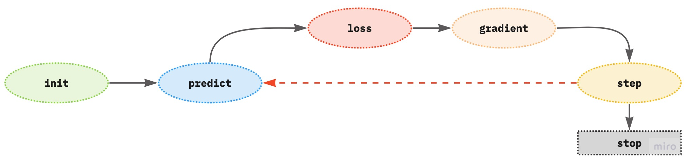</center>

The gradients (derivatives of the loss function with respect to the weights) provide the direction of the loss if we change the parameter by one unit, but not the exact amount by how many units a parameter should be changed to achieve the lowest model loss.

Properties to consider:

- SGD takes training samples one at a time (GD takes the complete training sample at once)
- the stochastic term means that the algorithm picks, at random, one training sample per step or training iteration
	- can handle large data sets due to this condition, however
		- the time to solution is slow
		- the loss function is *volatile* since it is affected by each sample independently, which makes the final result not optimal

**13. Why does SGD use mini-batches?**

Mini-batch SGD is the middle ground between GD (gradient descent) and SGD to overcome the negative aspects of each optimization algorithm (see previous question). Mini-batch enables the use of a random subset of the training samples so that the results are not as volatile as in SGD. Also, it can harness the power of GPU for faster computation.

**14. What are the seven steps in SGD for machine learning?**

Given the SGD process 

<center>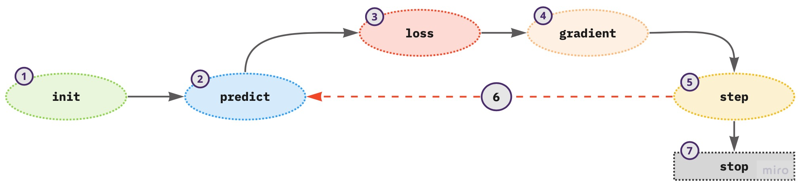</center>

	
1. initialize the weights - use random values
2. for each training sample in a mini-batch use the weights to compute the prediction
3. given the calculated predictions compute the model loss on the mini-batch
4. calculate the gradients of the loss with respect to weight parameters - tells us the direction of the loss for one unit change in the parameters
5. update the weights according to step (4)
6. repeat the steps from (2) to (5)
7. iterate until (1) the model loss is low enough and the model is not overfitting; (2) time constraint

**15. How do we initialize the weights in a model?**

Random initialization of weights proved to be good enough for many deep learning problems.

**16.  What is loss?**

Loss provides the information how far are our model predictions from the ground truth of the target labels. Lower values of the loss represent better model since our predictions are closer to the *truth*.

**TODO 17.  Why can’t we always use a high learning rate?**

Learning rate represents the amplification rate with which the weights will be updated given the gradients. Using a high learning rate can make the loss might *bounce* around and not achieving the minimum. 
   
**18.  What is a gradient?**

Gradient is a derivative of the loss function with respect to the underlying model parameter (weights).
Gradients provide the direction of the loss if we change the parameter by one unit, but not the exact amount by how many units a parameter should be changed to achieve the lowest loss.
   
**19.  Do you need to know how to calculate gradients yourself?**

No. PyTorch computes the gradients automatically (*automatic differentiation*). We just need to define the loss function.

To compute the gradients in PyTorch we need 

- `.requires_grad()` - means that at this object point we want to see the value of the gradient
- `.backwards()` - computes the derivative wrt the object we said to require a gradient i.e. `requires_grad_()`

**20.  Why can’t we use accuracy as a loss function?**

In order to update the parameters of the model we need gradients and for the gradients to exist the underlying loss function needs to be differentiable. Accuracy is not continuous and hence not differentiable. Also, recall that we need our loss function to be *responsive* to small changes in weights in order actually optimize our model weights. Accuracy changes only when the prediction class changes. Hence there can be instances when if we change the weights  there is no effect on the model loss since our predictions have not changed hence the weights can not be updated further.

**21.  Draw the sigmoid function. What is special about its shape?**

Using Python to draw the sigmoid function:

```python
import matplotlib.pyplot as plt
import numpy as np

# Define the function
def sigmoid(x):
	return 1/(1+np.exp(-x))

# Plot the function
x = np.linspace(-15,15,1000)
y = sigmoid(x)
plt.style.use('ggplot')
plt.plot(x,y)
plt.title('Sigmoid function')
plt.show()
```

<center>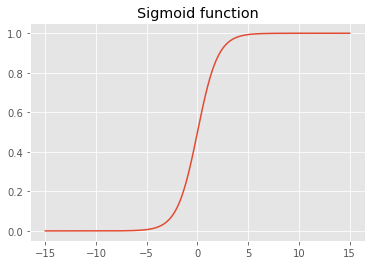</center>

The sigmoid function constrains the output to the interval `(0,1)`.

**22.  What is the difference between a loss function and a metric?**

Loss function is used in training to optimize the weights of the model while the metric is used to assess the model performance. Model metric is given in terms of explainability of the model performance given the project goals. The metric needs to be "human understandable" while the loss function needs to be suitable mathematically for the optimization process (SGD), i.e. differentiable.

There can be instances that the loss and metric are equally defined.

**23.  What is the function to calculate new weights using a learning rate?**

Updating of the weights is part of the optimizer, namely in the `step` function. An example of the optimizer class:

```python
class BasicOptim:
	def __init__(self, params, lr):
	self.params = list(params) # list of parameters
	self.lr = lr # learning rate
	
	def step(self, *args, **kwargs):
		for p in self.params:
			p.data -= p.grad.data * self.lr
	
	def zero_grad(self, *args, **kwargs):
		for p in self.params:
			p.grad = None
```

**24.  What does the DataLoader class do?**

`DataLoader` class creates the iterator for the training process taking in:

- the dataset in the form of a tuple of `(input sample, sample target label)`,
- batch size information
- whether to shuffle the data or not.
 
**25.  Write pseudocode showing the basic steps taken in each epoch for SGD.**

```python
for xb, yb in dl:
	preds = model(xb) # Model predictions
    loss = loss_function(preds, yb) # Model loss
	loss.backwards() # Derivative 
	
	# Update weights
	parameters -= parameters.grad * ls
```

where:

- `dl` is the dataloader
- `xy` input sample, `yb` input sample target label

**26. Create a function that, if passed two arguments [1,2,3,4] and 'abcd', returns [(1, 'a'), (2, 'b'), (3, 'c'), (4, 'd')]. What is special about that output data structure?**

```python
# Python
def my_func(a:list,b:str):
	return list(zip(a,b))

# FastAI
L(zip(a,b))
```
The function returns a tuple which is generally used in PyTorch `DataSet` to denote the pairs of independent and dependent variables.

**27.  What does view do in PyTorch?**

`torch.view()` changes the shape of the tensor but not its data. It returns a tensor and "...avoids explicit data copy" ([PyTorch docs](https://pytorch.org/docs/stable/generated/torch.Tensor.view.html#torch.Tensor.view)). Visual example of different possible shape changes for an array of `4x4`:

<center>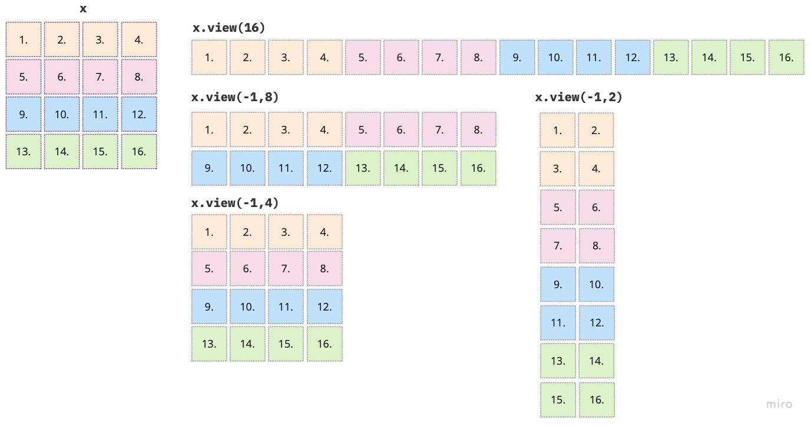</center>

**28.  What are the bias parameters in a neural network? Why do we need them?**

Biases, along with the weights, are parameters which are updated during training of a neural network. Recall that the linear layer of a neural network is defined as 

$$
y=w*x + b
$$

where $w$ are the weights, $x$ the inputs and $b$ the bias parameter. If there is no bias term we would only have a linear function going through the origin, which would in turn limit what we can model. The bias term has two main properties:

- it ensures that there is a value of the function $y$, different from 0, even when there is no input value, i.e. the value of $x$ is zero;
	- if $x$ is zero and there is no bias term, then zero is the input to the activation function, which in case of sigmoid we will get 0.5, ReLU will give 0, etc. - not quite informative
- it shifts the activation function to the left or right depending on the sign value

For example, let's take the sigmoid function and plot it with several different weight ($w$) values without the addition of the bias term.

<center>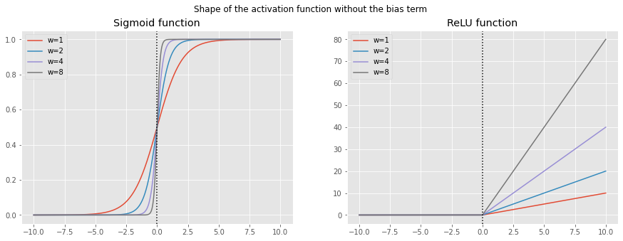</center>

As we can see the origin of the function stays the same only the steepness shifts according to the change in $w$. To add more flexibility in training a neural network we also need the shift to the left and right, which is achieved by adding the bias term $b$, see figure below. Now the activation function can cover all directions.

<center>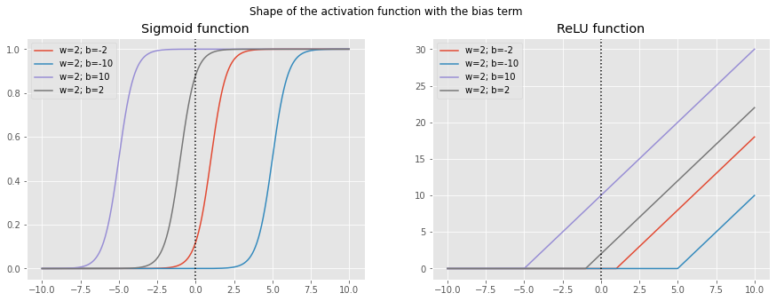</center>

```python

weights = [1,2,4, 8]
x = np.linspace(-10,10,1000)

fig, ax = plt.subplots(1,2, figsize=(15,5))
fig.suptitle('Shape of the activation function without the bias term')

# Sigmoid
for w in weights:
	y = sigmoid(x*w)
	ax[0].plot(x,y, label=f'w={w}')
	ax[0].set_title('Sigmoid function')
	ax[0].legend()
	ax[0].axvline(x=0, ymin=0, ymax=1, c='black', linestyle='dotted')

#ReLU
for w in weights:
	y = relu(x*w)
	ax[1].plot(x,y, label=f'w={w}')
	ax[1].set_title('ReLU function')
	ax[1].axvline(x=0, ymin=0, ymax=1, c='black', linestyle='dotted')
	ax[1].legend()

plt.show()
```

```python

weights = [2]
bias = [-2,-10,10,2]
x = np.linspace(-10,10,1000)

fig, ax = plt.subplots(1,2, figsize=(15,5))
fig.suptitle('Shape of the activation function with the bias term')

# Sigmoid
for b in bias:
	y = sigmoid(x*2 + b)
	ax[0].plot(x,y, label=f'w=2; b={b}')
	ax[0].set_title('Sigmoid function')
	ax[0].axvline(x=0, ymin=0, ymax=1, c='black', linestyle='dotted')
	ax[0].legend()

#ReLU
for b in bias:
	y = relu(x*2 + b)
	ax[1].plot(x,y, label=f'w=2; b={b}')
	ax[1].set_title('ReLU function')
	ax[1].axvline(x=0, ymin=0, ymax=1, c='black', linestyle='dotted')
	ax[1].legend()

plt.show()
```

**29.  What does the @ operator do in Python?**

`@` operator performs matrix multiplication in Python. For example, we can use it as follows:
```python
y = xb@weights
```
it will multiply every row of `xb` with `weights`.

**30.  What does the backward method do?**

`.backward()` method computes the derivative of the loss function with respect to the object we said to require a gradient for i.e. object with the `requires_grad_()`. 
Since we are updating parameters during training we need to have the derivative of the loss function with respect to those parameters. So we usually would set 

```python
params = torch.randn(3).requires_grad_()
```

in order to later call 

```python
loss.backward()
```
to compute the derivative of the loss function with respect to `params`.

**31.  Why do we have to zero the gradients?**

Training the neural network and optimizing the loss function is an iterative process where in each pass we strive to update the parameters. Each such update is done via the gradients using `loss.backward()` which tells us by how much the loss will change for a unit change in the parameters. By default `loss.backward()` does not forget the values from the previous iteration, but rather it adds the gradients of the loss to any gradients calculated from the previous iteration, i.e. it accumulates the values. Therefore, in order to correctly update the weights we need to delete the gradients once we updated the model parameters.

**32.  What information do we have to pass to Learner?**

To the `Learner` we pass the following information:

- DataLoader
- model architecture - standard PyTorch model; "...make sure it accepts the number of inputs you have in your [`DataLoaders`](https://docs.fast.ai/data.core.html#dataloaders) and returns as many outputs as you have targets." ([fast.ai docs page](https://docs.fast.ai/learner.html#learner))
- optimization algorithm
- loss function
- metrics

More info on [fast.ai docs page](https://docs.fast.ai/learner.html#learner).

**33.  Show Python or pseudocode for the basic steps of a training loop.**

```python
# Number of epochs
no_epochs = 50

def train_nn_single(model, lr, params):
	for xb, yb in dl:
		calc_grad(xb, yb, params)
		for p in params:
			p.data -= p.grad * lr
			p.grad.zero_()

for n in range(no_epochs):
	train_nn_single(model, lr, params)
```
**34.  What is ReLU? Draw a plot of it for values from -2 to +2.**

ReLU stands for rectified linear units function, which assigns 0 to all negative values. It is used as an activation function in neural networks, i.e. it ass nonlinearity. 

To draw a plot we use Python:

```python
# Define ReLU function
def relu(x):
	return np.maximum(0.,x)

import numpy as np
x = np.linspace(-2,2,100)
y = relu(x)

import matplotlib.pyplot as plt
plt.style.use('ggplot')
plt.plot(x,y)
plt.title('ReLU function')
plt.show()
```

<center></center>

**35.  What is an activation function?**

Activation function represents the nonlinearity of a neural network. 

As we have seen in chapter 1, we need more than one layer in the neural network to be able to model more complex functions. However, stacking many linear layers and performing multiplication and addition is again a linear layer, which does not help us in solving more complex functions. 

To solve this problem a new non-linear layer or the activation function is added in between the linear layers. Furthermore, this leads to the universal approximation theorem, which basically states that this non-linear layer "...can solve any computable problem to an arbitrarily high level of accuracy".

**36.  What’s the difference between F.relu and nn.ReLU?**

There is no difference between `F.relu` and `nn.ReLU`. `F.relu` is a Python function, while `nn.ReLU` belongs to the PyTorch library. Both represent ReLU function.

**37.  The universal approximation theorem shows that any function can be approximated as closely as needed using just one nonlinearity. So why do we normally use more?**

To be able to model more complex function we need more linear layers, which in turn requires more non-linear layers. As we build deeper models (with more layers) smaller number of parameters as well as smaller matrices result in better more performance as compared to larger matrices with smaller number of layers and more parameters.
